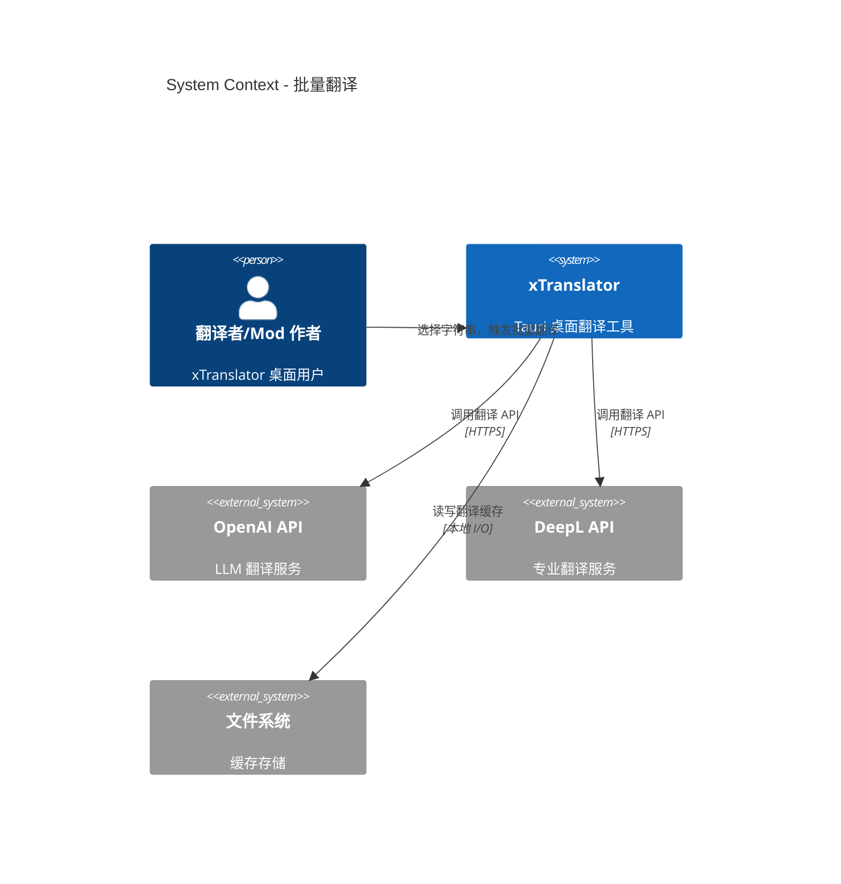

# System Context: 批量翻译

## Actors

| Actor | Type | Description |
|-------|------|-------------|
| 翻译者/Mod 作者 | Human | 桌面应用的主要用户，需要批量翻译游戏字符串 |
| OpenAI API | System (External) | 大语言模型翻译服务，REST API |
| DeepL API | System (External) | 专业翻译服务，REST API |

## External Systems

| System | Direction | Data Exchanged | Protocol | Risk |
|--------|-----------|----------------|----------|------|
| OpenAI API | Outbound | 待翻译文本 + 目标语言 → 翻译结果 | HTTPS REST | High: API 不可用或限流 |
| DeepL API | Outbound | 待翻译文本 + 目标语言 → 翻译结果 | HTTPS REST | High: API 不可用或限流 |
| 文件系统 (缓存) | Outbound | 翻译结果写入 append-only journal | 本地 I/O | Low: 磁盘空间不足 |
| 文件系统 (ESP cache) | Outbound | 翻译后更新 ESP 缓存 | 本地 I/O | Low |

## Data Flows

### Inbound
- **用户选择**: 从 ESP 字符串列表中选中 N 条待翻译条目 → 提交批量翻译
- **API Key**: 从内存中读取（不持久化），用于 API 认证
- **翻译结果**: API 返回的 JSON 响应 → 解析出翻译文本

### Outbound
- **翻译请求**: `POST /v1/chat/completions` (OpenAI) 或 `POST /v2/translate` (DeepL)，含 system prompt + 源文本
- **缓存写入**: append-only journal 文件，逐条追加 `(str_id, source, translated, timestamp)`
- **ESP 更新**: 翻译完成后更新内存中的 `SkyString.translation` 字段 + 刷新 ESP cache

## Context Diagram

## System Boundaries

本 intent 不涉及以下外部系统：
- 翻译记忆/词典服务（未来可能扩展）
- 云端同步/协作
- 用户认证服务
- 分析/遥测

## Assumptions

- 用户已为至少一个 Provider（OpenAI/DeepL）配置 API Key
- 网络连接可用（API 调用需要）
- 磁盘空间足够写入缓存文件（< 10MB）
- 翻译在单一桌面应用中运行，无需考虑多用户/分布式
